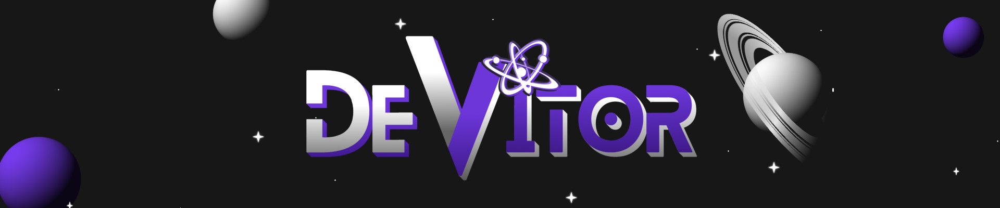

  

<h1>Olá, eu sou o Vitor 🖖🏻</h1>

🧔🏻 Sou desenvolvedor Front-end, gosto de criar coisas e conhecimento é o sentido da minha vida.

 

- 🌱 Atualmente aprendendo sobre **React JS, TypeScript, Next JS e Node JS**;
- 💬 Me pergunte sobre: **JavaScript, HTML, CSS e React JS**;
- 🔍 Procurando se especializar no Front-end;
- ⚡ Fato engraçado: Agora foquete dá ré 🚀;

 

### 🛠 Linguagens e ferramentas que uso: ###

  

### 🔍 Contato: ###

  
  
      

